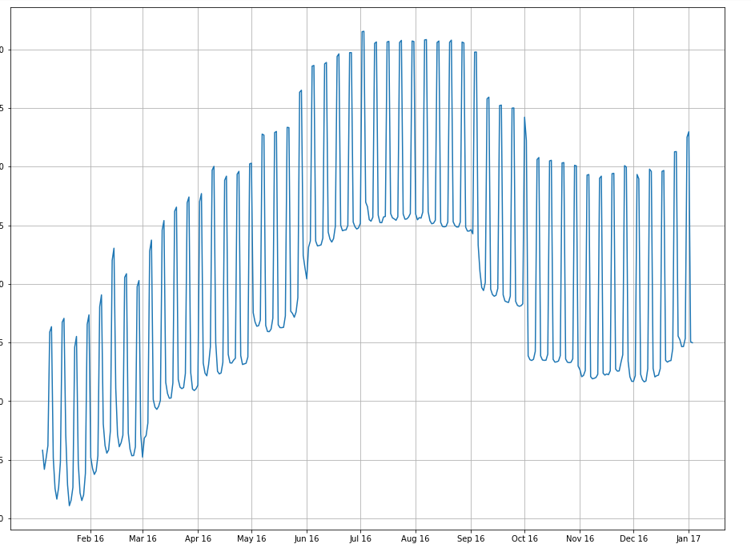

# AirBnB Data Analysis

Weird looking graph, right ? 

Let's take a look and see how we reached this graph and what does it mean. 

We all now Seattle and AirBnB. However, what we do not yet now is what is the link. That is it, it is data. AirBnB operates in property renting in many cities around the world and Seattle is one of these many cities.  We are lucky enough that AirBnB decided to publish their data from Seattle for us Data Scientists to analyze and get insights from. Alright, enough of this introductory talk let's dive into what we find in this data. 

