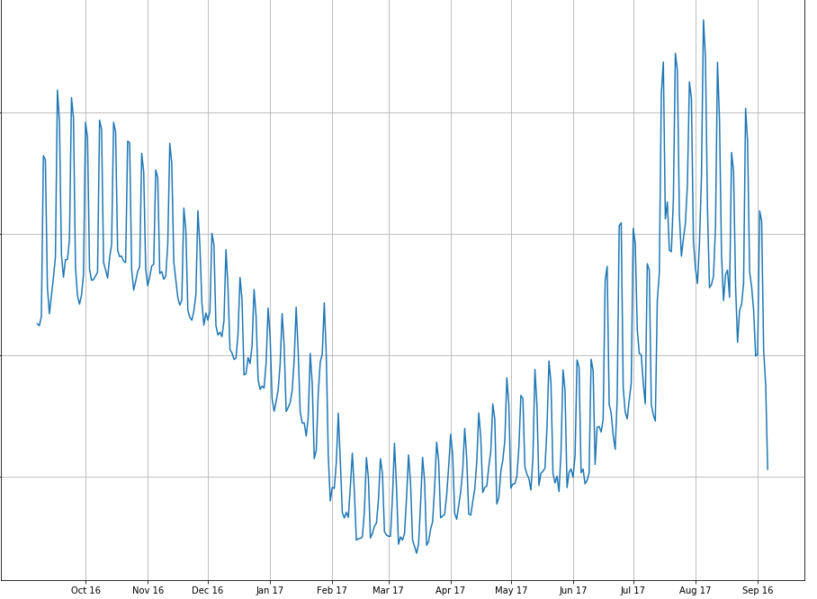

# Let's Predict AirBnB Prices! 

Weird looking graph, right ? 

Let's take a look and see how we reached this graph and what does it mean. 

We all know Seattle and AirBnB. However, what we do not yet now is what is the link. That is it, it is data. AirBnB operates on property renting in many cities around the world and Seattle is one of these many cities.  We are lucky enough that AirBnB decided to publish their data from Seattle for us Data Scientists to analyze and get insights from. Alright, enough of this introductory talk let's dive into what we found in this data. 

We had primarily 4 questions in mind when analyzing this data. Before we begin, it is worth mentioning that we also used the AirBnB data from Boston to compare with Seattle. 

The four questions:

1. How well can we predict the listing prices ? 
2. Which attributes correlate the most with the price of the listing? 
3. Can we find a specific distribution of price changes during a whole calendar year ? 
4. What are the similarities and differences between the Boston and Seattle Data? 

## Listing Prices:

After thorough cleaning and analysis of listing information of the rentals, we managed to fit a model to predict the prices based on features of the listing like number of accommodates, bedroom... etc. Our Model was able to predict prices within a range of $32 on average from the real prices which is good enough. Next we analyzed what factors attribute more to the price. Let's look at the following diagram:

Here the blue features are features that contribute positively to price i.e. if they increase the price increases and the red features are the opposites. 

The top Features that increase the price are the number of accommodates, beds, bedrooms and bathrooms. Also, being an entire home or apartment apparently is attributed with higher prices. Being from Queen Anne Neighborhood or having a doorman increases prices. 

On the other hands, listings that are private or share rooms obviously cost less than entire home. What sparks my attention is that higher numbers of reviews and reviews per month are attributed with lower prices. My explanation is that active listings that are constantly rented and thus rated a lot are usually cheaper. 

Now let's look at the same diagram for Boston:

Apart from the similarities with the Seattle data like number of accommodates, bedrooms and  being an entire home or apartment and neighborhood features. What interested me most is the appearance of the coordinates in price. Which shows that the increase in longitude (towards east ) and in latitude (to north) is attributed with higher prices. That shows that listings closer to the ocean are obviously more expensive. 

## Calendar Price Distributions:

I analyze the trend of the prices throughout on calendar year in Seattle and Boston to get an idea on how prices change throughout the year for planners to plan ahead. Here is Seattle's plot:

Ah yes! it is the picture in the header. Now, let's make sense of this odd-looking graph. First, let's address the elephant in the room. By that I mean the weird constant sharp fluctuations which is explained by the prices being different on weekends (higher than) from weekdays. Specifically, prices on Fridays and Saturdays are usually higher that the other five days of the weak. Other than that,  we see a steady increase of prices when moving towards the summer and peaks between June and September. 

Now let's look at Boston's Data:

Here we still see the spikes of the weekends and also the increase of prices in the summer. However, unlike in Seattle the prices stay high in October and then decreases again. This might be explained by global events like Columbus day parade. 

## Call for action:

We believe that this data and further analysis and data engineering can be used by AirBnB to help hosts better tune their listings to attract customers and inform them about the expected range of the prices.